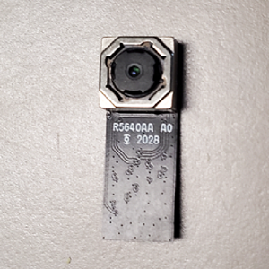

# NXP Application Code Hub

## ML Dry Beans Image Classification Using eIQ
Step-by-step guide for deployment of an image classification model on an MCU-based system. A balanced image classification model is developed using the eIQ portal to classify 5 types of dry beans. 

This balanced image classification model was trained on 5 types of dry beans - black beans, garbanzo beans, green split peas, small red beans and yellow split peas - using the eIQ portal. The provided model was trained using an input size of 128x128x3 and over 25 epoches. The model was then exported from the eIQ portal as an int8 quantized tflite model. 

The image classification model is then deployed on RT1170-EVK which is an evaluation board, equipped with a 1GHz Arm Cortex-M7 core and a 400MHz Arm Cortex-M4 core, that is useful for evaluation and protyping using the MCUXpresso suite. The RT1170-EVK board memory consists of a 512 Mbit SDRAM, a 512 Mbit Octal Flash, a 128 Mbit QPSI Flash, a 2 Gbit Raw NAND Flash, a 64 Mbit LPSPI Flash and a TF socket for an SD card. 

#### Boards: MIMXRT1170-EVK
#### Categories: AI/ML, Vision
#### Peripherals: DISPLAY, VIDEO
#### Toolchains: MCUXpresso IDE

## Table of Contents
1. [Software](#step1)
2. [Hardware](#step2)
3. [Model Generation using eIQ Portal](#step3)
4. [Software Setup](#step4)
5. [Hardware Setup](#step5)
6. [Results](#step6)
7. [FAQs](#step7) 
8. [Support](#step8)
9. [Release Notes](#step9)

## 1. Software
- Download and Install [MCUXpresso IDE v11.8.0+](https://www.nxp.com/design/software/development-software/mcuxpresso-software-and-tools-/mcuxpresso-integrated-development-environment-ide:MCUXpresso-IDE). 

- Download and install [eIQ Toolkit](https://www.nxp.com/design/software/eiq-ml-development-environment/eiq-toolkit-for-end-to-end-model-development-and-deployment:EIQ-TOOLKIT).

- Download the software package in this repository. 

- (Optional) Install a terminal window such as [TeraTerm](https://ttssh2.osdn.jp/index.html.en).

## 2. Hardware
- Purchase supported board:
    - [MIMXRT1170-EVK](https://www.nxp.com/design/development-boards/i-mx-evaluation-and-development-boards/i-mx-rt1170-evaluation-kit:MIMXRT1170-EVK)
    
    

    - 0V5640 MIPI camera module (comes with EVK board)
    
    

- Purchase supported display: 
    - [RK055HDMIPI4MA0](https://www.nxp.com/part/RK055HDMIPI4MA0#/)
    
    

## 3. Model Generation using eIQ Portal
Open the eIQ Portal and follow the below-mentioned sections from the eIQ Toolkit User Guide found in the documentation section of the [eIQ Toolkit page](https://www.nxp.com/design/software/eiq-ml-development-environment/eiq-toolkit-for-end-to-end-model-development-and-deployment:EIQ-TOOLKIT).

### 3.1
Follow *Section 3.2* and *Section 3.3.2* to import the [dataset](Dry%20Beans%20Complete%20Dataset) and create a new project. The [dataset](Dry%20Beans%20Complete%20Dataset) folder in this repository follows the naming convention of the structured folders dataset cited in *Section 3.3.2*.

### 3.2
Follow *Section 3.5.2* to create a train-test split for the [dataset](Dry%20Beans%20Complete%20Dataset). 

### 3.3
Follow *Section 3.6.1* to select the best-suited model for the target. The model used in this software package is a balanced classification mobilenet v2 model for MCU. 

### 3.4
Follow *Section 3.7* to the train the selected model by adjusting the training parameters. 

### 3.5
Follow *Section 3.8* to validate the model. The confusion matrix and the per-class matrix from the validation process for the model used in this software package are shown below: 

### 3.6
Follow *Section 3.9* to export the model from the eIQ portal. The model used in this software package is an int8 quantized tflite model. 

### 3.7
Follow *Section 3.10* to quantized the trained model to decrease its size and improve its inference time. 

## 4. Software Setup
To run the software package given in this repository, open [MCUXpresso IDE v11.8.0+](https://www.nxp.com/design/software/development-software/mcuxpresso-software-and-tools-/mcuxpresso-integrated-development-environment-ide:MCUXpresso-IDE) and follow the below-mentioned sections from the MCUXpresso IDE User Guide found in the documentation section of the [MCUXpresso IDE page](https://www.nxp.com/design/software/development-software/mcuxpresso-software-and-tools-/mcuxpresso-integrated-development-environment-ide:MCUXpresso-IDE).

### 4.1 
Follow *Section 10.3* to import this project into MCUXpresso IDE. 

### 4.2
Follow *Section 21.2* to change the build configuration to release build. Then follow *Section 5.2* to build the project. After building the project, the *console* should display the following: 

### 4.3
Follow *Section 13* to debug the project. 

### 4.4
Open your terminal window such as [Tera Term](https://ttssh2.osdn.jp/index.html.en) or follow *Section 21.8* for using terminal view for UART communication with target to see the inference results from the camera input. Make sure to connect to the COM port that the board enumerated as and use 115200 baud, 1 stop bit and no parity.

## 5. Hardware Setup 
Attach the LCD to J48 port on the back of the board as shown in the image below.

Attach the camera to J2 port as shown in the image below. 

## 6. Results
The inferencing results from the MIPI camera input should be displayed on the terminal and LCD as shown below. Sample images of the 5 classes of dry beans are also shown below.

## 7. FAQs
### Question 1: Nothing is being displayed on my LCD screen. 
Answer: If you have a [RK055HDMIPI4MA0](https://www.nxp.com/part/RK055HDMIPI4MA0#/) LCD, then in source/video/eiq_display_config.h file change line 41 to "#define DEMO_PANEL DEMO_PANEL_RK055MHD091". If you are using the old LCD display panel - [RK055HDMIPI4M](https://www.nxp.com/part/RK055HDMIPI4M#/), then change line 41 to "#define DEMO_PANEL DEMO_PANEL_RK055AHD091".

### Question 2: I want to run an image classification model I generated using the eIQ portal for the given dry beans dataset and not the model used in this software package. How do I go about this? 
Answer: If you would like to run your own image classification model that you have generated using the eIQ portal instead of the the model used in this software package, then please follow *Section 4* and *Section 5* of the [eIQ TensorFlow Lite for Microcontrollers Lab for i.MX RT1170 - With Camera.pdf](https://community.nxp.com/t5/eIQ-Machine-Learning-Software/Getting-Started-with-TensorFlow-Lite-for-Microcontrollers-on-i/ta-p/1124103) - Revision 5, August 2023. 

## 8. Support
#### Project Metadata
<!----- Boards ----->

<!----- Categories ----->
 

<!----- Peripherals ----->
 

<!----- Toolchains ----->

Questions regarding the content/correctness of this example can be entered as Issues within this GitHub repository.

>**Warning**: For more general technical questions regarding NXP Microcontrollers and the difference in expected funcionality, enter your questions on the [NXP Community Forum](https://community.nxp.com/)

## 9. Release Notes
| Version | Description / Update                           | Date                        |
|:-------:|------------------------------------------------|----------------------------:|
| 1.0     | Initial release on Application Code Hub        | September 18th 2023 |

